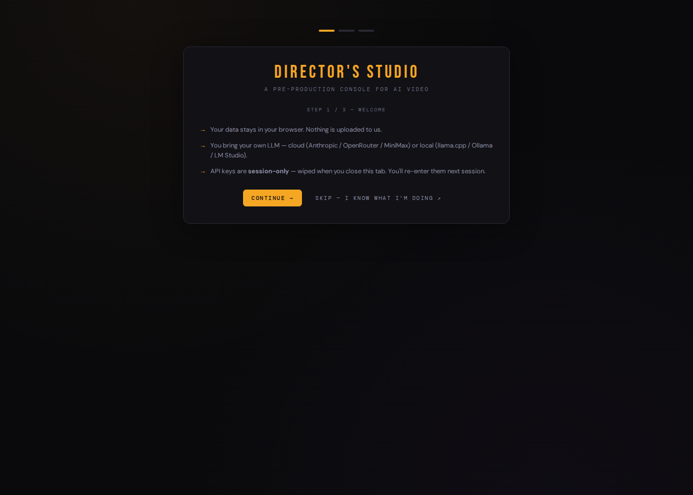
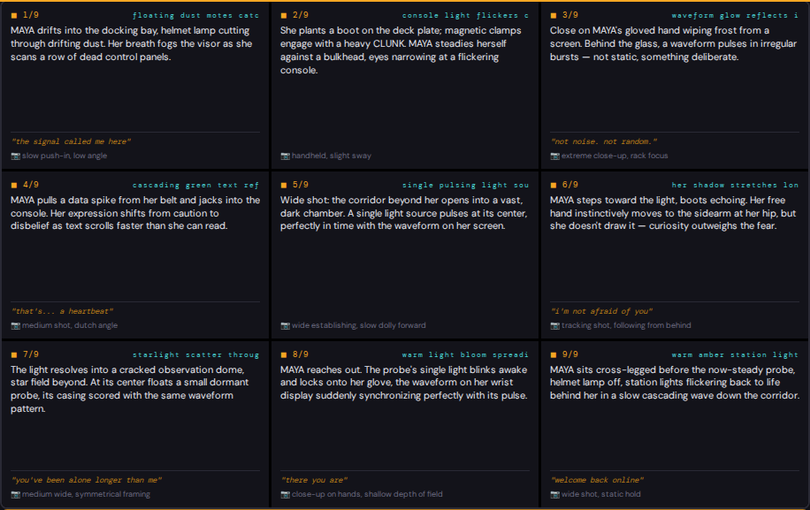
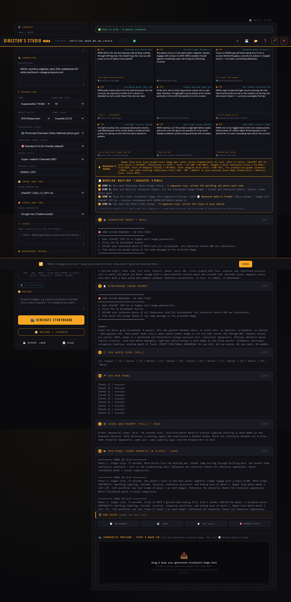

# Director's Board

**A single-file HTML tool for AI-assisted storyboard generation.**

Turn a one-line concept into character sheets, a composite storyboard image, scripted text overlays, and per-panel video generation prompts — all formatted for the AI tool of your choice (Anthropic Claude, OpenRouter, ChatGPT GPT-4o, Midjourney, Imagen 4, FLUX, SDXL, Grok Imagine).

> Built as a planning layer between *"I have an idea"* and *"I have a video."*




<details>
<summary>Full generated output (character sheet, storyboard prompt, IPA sync, per-panel video prompts, bake-in drop zone)</summary>



</details>

---

## Read this first — it's a manual tool

Director's Board does **not** generate images or video itself. It writes the **prompts** — you paste each one into your own image generator (Midjourney, ChatGPT, Imagen, FLUX, whatever you already use) or your own video generator (Veo, Runway, Kling, whatever you already use), one step at a time, with you handling the files in between. It's a director's script supervisor, not an autopilot: it plans every shot, you run them.

**The loop that makes the video step actually work — bringing the image back in:**

1. Run the **Storyboard Composite** prompt in your image tool. You get back one clean N-panel photo grid — no text baked in yet, photography only.
2. **Bring that image back into Director's Board** — drop it on the Composite Preview box (bottom of the app) — and click **Generate Bake-in Prompt**. This writes a *new* prompt whose job is to take your clean grid and burn the scene label, action line, and dialogue/VO text directly onto each panel.
3. Paste that prompt **plus your storyboard image** into an image-edit-capable tool (ChatGPT GPT-4o is the one that reliably follows this kind of instruction). It generates *another* image — same 9 panels, now with every panel's story beat visible as baked-in text.
4. Take that captioned image, together with the per-panel video prompts Director's Board already wrote, to your video tool. Because the reference image itself now carries the scene/action/dialogue as visible text, your video generator effectively reads a director's shot list instead of a bare photo grid — it has context for what's supposed to be happening in each panel, not just what it looks like.

**Beyond video.** The pipeline above is one use of this tool, not the only one. **Character Sheets** on their own are useful any time you need a consistent, multi-angle reference sheet for an AI-generated character — game assets, illustration, concept art, tabletop material, anything. It's BYOK and provider-agnostic: point it at whatever LLM you already have access to — a paid API, a free-tier key, or a model you're running locally — and use it for whatever storyboarding or character-design task you actually have.

---

## What it does

Director's Board runs a multi-trip workflow. Each step produces a copy-paste-ready prompt tuned to your selected AI tool, with explicit instructions on how to attach reference photos and what tool-specific syntax to use.

**The four trips:**

1. **Character Sheets** — One image-gen prompt per character (research-backed 4-view 2×2 grid format), with mandatory reference-photo upload instructions. Multi-character projects produce one prompt per character because mixed-grid sheets fail at the tool level.
2. **Storyboard Composite** — A single prompt to assemble all character sheets into a clean N-panel storyboard image (no text, just the photography).
3. **Bake-in Directives** — Drop the clean storyboard image back into the app, click one button, get a tool-aware prompt that bakes scene labels, action descriptions, and voice-over text into each panel's caption block. Run that in an image-edit-capable tool and you get back a captioned "director's cut" of the storyboard — see [Read this first](#read-this-first--its-a-manual-tool) for why this step is what lets your video generator understand each shot, not just see it.
4. **Per-Panel Video Clips** — N separate single-clip prompts with continuity instructions for image-to-video chaining (Wan 2.2, Runway, Kling, Luma, Veo 3, Sora, Hailuo, Pika).

It's tool-agnostic, BYOK (Bring Your Own Key), runs from a single HTML file with no build step, and treats every page load as a true blank canvas — no persistent storage of your projects, briefs, or API keys.

---

## Quick start

1. **Download** `index.html` from this repo.
2. **Open** it in a recent Chrome / Edge / Firefox browser. *(If you see CORS errors when calling APIs from `file://`, see [Browser support](#browser-support) below.)*
3. **A 3-step welcome screen opens.** It states the privacy model up front (your data stays in your browser, API keys are session-only) and either walks you through setup or lets you skip straight to **Settings**. From Settings, choose your API endpoint:
   - **Anthropic Direct** — recommended; stateless. Get a key from [console.anthropic.com](https://console.anthropic.com).
   - **OpenAI Direct** — GPT-4o / GPT-5.x.
   - **OpenRouter** — multi-model gateway (Claude, GPT-4o, Gemini, more). Key from [openrouter.ai](https://openrouter.ai).
   - **MiniMax** — alternative cloud provider.
   - **Local LLM** — llama.cpp, Ollama, LM Studio, or any OpenAI-compatible endpoint.
   - **Custom** — for Together AI, fal.ai, custom proxies, etc.
4. **Paste your API key** and save.
5. **Fill in:** project title, concept (one-line description of your video), characters (one per line), tone, duration, panel count, your image-gen tool, your video-gen tool.
6. **Click GENERATE STORYBOARD.**
7. **Follow the in-app workflow guide** to take each output to your image / video gen tool.

---

## Workflow at a glance

```
   YOUR BRIEF
       │
       ▼
   ╔═══════════════════════════════╗
   ║  STEP 1 — Character Sheets    ║   N runs in your image gen
   ║  (one prompt per character,   ║   (attach matching ref photo each time)
   ║   ref-photo upload required)  ║
   ╚═══════════════════════════════╝
       │
       ▼
   ╔═══════════════════════════════╗
   ║  STEP 2 — Storyboard          ║   1 run in your image gen
   ║  Composite Image              ║   (attach all character sheets)
   ║  (clean photo grid, no text)  ║
   ╚═══════════════════════════════╝
       │
       ▼
   ╔═══════════════════════════════╗
   ║  STEP 3 — Bake-in Directives  ║   1 run, ChatGPT GPT-4o recommended
   ║  (text overlays baked into    ║   (attach the storyboard image)
   ║   each panel)                 ║
   ╚═══════════════════════════════╝
       │
       ▼
   ╔═══════════════════════════════╗
   ║  STEP 4 — Per-Panel Video     ║   N runs in your video gen
   ║  Clips                        ║   (with image-to-video continuity)
   ╚═══════════════════════════════╝
       │
       ▼
   STITCH IN YOUR EDITOR  →  FINAL VIDEO
```

---

## Image gen tool recommendations

Different tools have different strengths. For human face-lock from prompt + reference photo (approximate, as of 2026):

| Tool | Face-lock | Best for | Notes |
|------|-----------|----------|-------|
| **Midjourney v7** with `--cref --cw 100` | ~85–90% | Strong likeness | Discord-only, paid |
| **Imagen 4** (Gemini / Vertex AI) | ~75–85% | Strong cloud option | Reference-image input field |
| **ChatGPT GPT-4o** | ~70–80% | **Best for Step 3** (text-on-image edits) | Image upload + paste prompt |
| **FLUX / SDXL** with IP-Adapter FaceID | ~70–85% | Local / advanced | Requires IP-Adapter model |
| **Grok Imagine** | ~60–75% | Limited face-lock | Recommend LoRA for production |

For production-quality (>90%) face matching:
- **LoRA training** — ~$5 per character on Replicate, ~20 min training run
- **Post-process face-swap** — FaceFusion or ReActor, free, runs locally on GPU

---

## Privacy & security

- **BYOK (Bring Your Own Key).** Your API key is session-only — held in browser memory while the tab is open and wiped when you close it. It is never sent anywhere except to the API endpoint you've explicitly configured. You'll re-enter it next session.
- **Project autosave, opt-in restore.** Unlike API keys, your in-progress project (brief, characters, panel state) *does* autosave to `localStorage` as you work, so a refresh or crash doesn't lose your draft. Reference-image data is stripped from the autosave payload (descriptions are kept, the images themselves are not) to keep it small and to avoid quietly accumulating uploaded-image data across sessions. On reload, a banner offers **Restore** or **Discard** — it is never restored silently.
- **No analytics, no tracking, no telemetry.** This is a static HTML file. It calls your chosen API and nothing else. No backend, no server, no third-party scripts beyond two well-known CDN libraries (html2canvas + html2pdf, both for export buttons).
- **No memory-aware backends in defaults.** The app does not connect to LLM endpoints with persistent user-memory layers. Custom endpoint option lets you connect to whatever you want — but be aware that memory-aware backends can leak cross-session personal data into outputs.
- **Anti-leak prompt defenses.** Character names are extracted from your brief client-side and passed to the model as exact literals; the system prompt forbids name substitution. This stops the model from hallucinating personal names from training-data context.

---

## API costs

You will spend real money on every generation. Approximate cost per storyboard generation with Claude Sonnet 4.5:

- ~10K input tokens × $3/MTok = **$0.03**
- ~5K output tokens × $15/MTok = **$0.08**
- **Total: ~$0.10–0.20 per storyboard generation**

Image generation costs (your image-gen tool of choice) and video generation costs (your video-gen tool) are separate and not covered above. Monitor your API spend; this app does not impose any cost limits or rate limits.

If you build something that exposes this tool publicly (e.g., embedding it on your website), you **must** add a server-side proxy with rate limiting and a hard daily budget cap — otherwise a single botnet visit can destroy your API budget in minutes.

---

## Browser support

Tested on Chrome 130+. Should work on recent Firefox and Edge. Safari is not regularly tested.

If you see CORS errors when opening from `file://`, serve the file via a local HTTP server:

```bash
# Python 3
python -m http.server 8000

# Node.js
npx http-server -p 8000

# Then open
http://localhost:8000/index.html
```

---

## What it doesn't do

This tool is a **planning and prompt-generation aid**. It does not:

- Generate the actual storyboard images (you take prompts to your image gen)
- Generate the actual video clips (you take prompts to your video gen)
- Stitch video clips together (use DaVinci Resolve, Premiere, CapCut, etc.)
- Train LoRAs or run face-swaps (use Replicate, FaceFusion, ReActor)
- Provide any kind of media output other than text prompts

It also does not include:

- A welcome / onboarding flow (planned for v3.0)
- A help system or in-app tutorials beyond tooltips
- Saved project templates or demo briefs
- Any opinion on what your video should be

---

## Versions

- **v4.0** — current public release. New 3-step welcome flow, project autosave (opt-in restore, API keys still session-only), OpenAI Direct added as a cloud provider, expanded local-LLM support. Jumps the public track's own numbering to match the underlying build directly.
- **v2.9.1** — previous public release. Sanitized placeholders, public-grade defaults.
- **v2.9** — added Bake-in Directives feature for Step 3.
- **v2.8** — public-grade pivot: blank-canvas init, anti-name-leak defenses, removal of LAN-only API presets.
- **v2.7.1** — hotfix for v2.7 template-literal regression.
- **v2.7** — per-character sheets, mandatory ref-photo instructions, per-panel video prompts.

Earlier versions (v2.5 and below) were personal-use prototypes and are not published.

---

## License

[MIT](LICENSE) — use it, modify it, redistribute it. No warranty.

---

## Disclaimer

This project is an independent tool. It is not affiliated with Anthropic, OpenAI, X.AI, Midjourney, Google, Black Forest Labs, Stability AI, or any other AI provider. Tool names referenced in the app are trademarks of their respective owners. You are responsible for your own API spend and for complying with the terms of service of whichever provider(s) you use.
